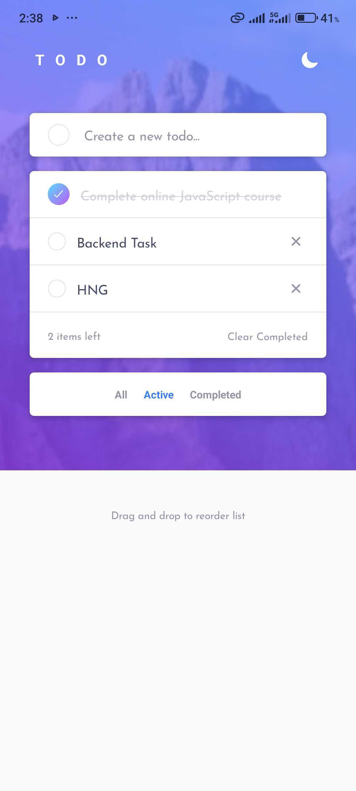
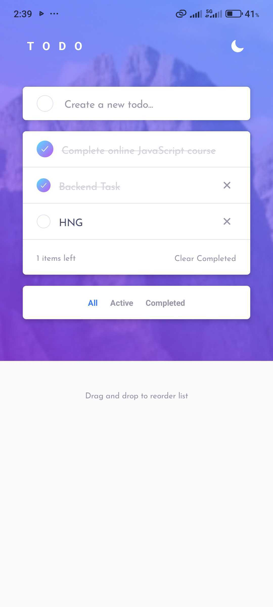
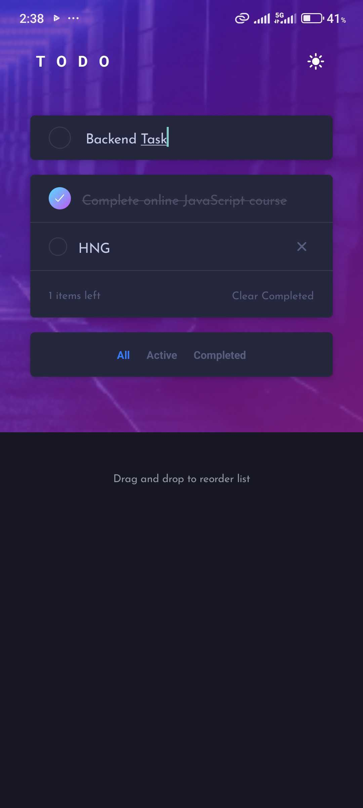

# Todo List Application

A sophisticated Todo List application built with React Native (Expo), featuring theme switching and real-time backend integration using Convex.

## Features
**Figma Design:** [View the design](https://www.figma.com/design/NRbd5hcrQcAa1LBbctUhf9/todo-app?node-id=0-458&t=sQW8KeS5ajimlcBu-0)

- ✅ **Full CRUD Operations** - Create, Read, Update, and Delete todos
- 🎨 **Light/Dark Theme** - Smooth theme transitions with persistent preferences
- ⚡ **Real-time Updates** - Powered by Convex for instant synchronization
- 🎯 **Pixel-Perfect Design** - Matches Figma design specifications
- 📱 **Responsive** - Works on all screen sizes (mobile, tablet, desktop)
- 🔍 **Filter & Sort** - View All, Active, or Completed todos
- ♿ **Accessible** - Screen reader support and proper contrast ratios

## Tech Stack

- **React Native** with Expo
- **TypeScript** for type safety
- **Convex** for real-time backend
- **AsyncStorage** for theme persistence
- **Expo Linear Gradient** for beautiful gradients
- **Expo Router** for navigation

## Prerequisites

- Node.js (v20.15.1 or higher recommended)
- npm or yarn
- Expo Go app (for mobile testing)
- Convex account (free at https://convex.dev)

## Setup Instructions

### 1. Clone the repository

```bash
git clone https://github.com/C3Techie/TODO-LIST-APPLICATION.git
cd TODO-LIST-APPLICATION/todo-app
```

### 2. Install dependencies

```bash
npm install
```

### 3. Set up Convex

The project is already configured with Convex. If you need to reinitialize:

```bash
npx convex dev --once --configure=new
```

This will:
- Create a new Convex project
- Generate `.env.local` with your Convex deployment URL
- Set up the backend functions

### 4. Environment Variables

Your `.env.local` file should contain:

```env
CONVEX_DEPLOYMENT=your-deployment-name
EXPO_PUBLIC_CONVEX_URL=https://your-deployment.convex.cloud
```

These are automatically created during Convex setup.

### 5. Deploy Convex functions

```bash
npx convex dev
```

This will watch for changes and deploy your Convex functions.

### 6. Start the app

In a new terminal:

```bash
npm start
```

Then:
- Press `a` to open on Android
- Press `i` to open on iOS (requires macOS)
- Press `w` to open in web browser
- Scan the QR code with Expo Go app

## Build Commands

### Development

```bash
npm start          # Start Expo development server
npm run android    # Run on Android device/emulator
npm run ios        # Run on iOS device/simulator (macOS only)
npm run web        # Run in web browser
```

### Production Build

```bash
# For Android APK
npx eas build --platform android --profile preview

# For iOS
npx eas build --platform ios --profile preview
```

## Project Structure

```
todo-app/
├── app/                    # Expo Router screens
│   ├── (tabs)/            # Tab navigation
│   │   └── index.tsx      # Main todo screen
│   └── _layout.tsx        # Root layout with providers
├── assets/                # Images and fonts
│   └── backgrounds/       # Theme backgrounds
├── convex/                # Convex backend
│   ├── schema.ts          # Database schema
│   └── todos.ts           # CRUD functions
├── src/
│   ├── components/        # Reusable UI components
│   │   ├── FilterBar.tsx
│   │   ├── ThemeSwitcher.tsx
│   │   ├── TodoInput.tsx
│   │   └── TodoItem.tsx
│   ├── hooks/             # Custom React hooks
│   │   └── useTheme.ts
│   ├── screens/           # Screen components
│   │   └── HomeScreen.tsx
│   ├── theme/             # Theme definitions
│   │   ├── dark.ts
│   │   ├── light.ts
│   │   └── index.ts
│   └── types/             # TypeScript types
│       └── index.ts
├── .env.local             # Environment variables (gitignored)
├── app.json               # Expo configuration
├── package.json           # Dependencies
└── tsconfig.json          # TypeScript configuration
```

## Convex Setup Steps

1. **Sign up** at https://convex.dev
2. **Run** `npx convex dev --once --configure=new`
3. **Login** when prompted
4. **Select** cloud deployment
5. The CLI will automatically:
   - Create your Convex project
   - Generate environment variables
   - Deploy your schema and functions

## Features Implementation

### Theme Switching
- Toggle between light and dark themes
- Theme preference persists across app restarts
- Smooth transitions using React Native animations
- Theme icon (sun/moon) in header

### CRUD Operations
- **Create**: Add new todos via input field
- **Read**: Real-time todo list from Convex
- **Update**: Toggle completion status, edit text
- **Delete**: Remove todos with delete button

### Filtering
- **All**: Show all todos
- **Active**: Show only incomplete todos
- **Completed**: Show only completed todos

### UI/UX
- Pixel-perfect implementation of Figma design
- Loading indicators for async operations
- Empty states for no todos
- Item count display
- Clear completed button

## Accessibility

- Proper color contrast ratios
- Screen reader support
- Keyboard navigation
- Touch target sizes (44x44pt minimum)

## Testing

Test the app on:

## Screenshots

### Mobile

<div align="center">
   
   
   
</div>

### Desktop

<div align="center">
   
   
   
</div>

## Troubleshooting

### Convex Connection Issues
```bash
# Restart Convex dev server
npx convex dev
```

### Metro Bundler Issues
```bash
# Clear cache and restart
npm start -- --clear
```

### TypeScript Errors
```bash
# Reload VS Code window
# Or restart TypeScript server
```

## Author

Christian Chibuike (C3Techie)

## Acknowledgments

- HNG Internship Program
- Figma design specifications
- Convex documentation
- React Native community

